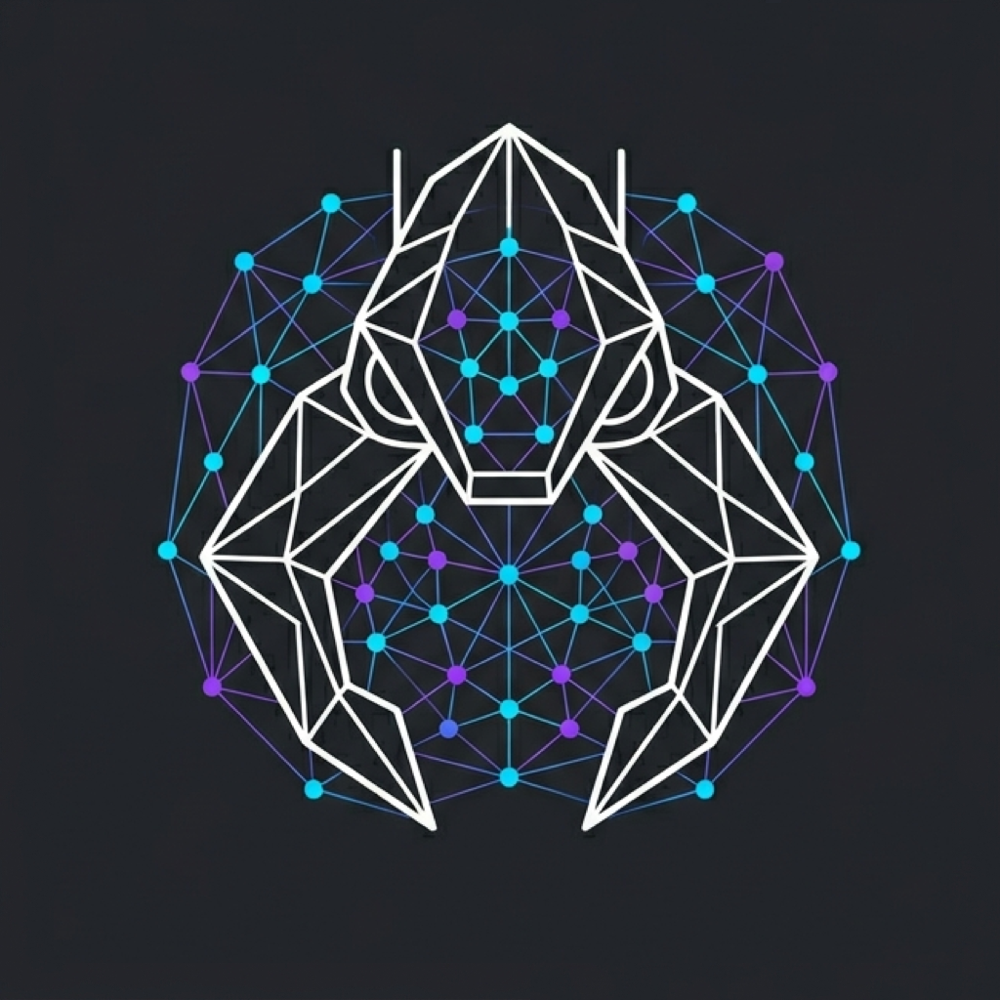

<p align="center">
  
</p>

<h1 align="center">SynapseClaw</h1>

<p align="center">
  <strong>Мультиагентный Rust-рантайм с IPC-брокером, веб-дашбордом и гексагональным ядром.</strong><br>
  Модели, инструменты, память, каналы и выполнение — один бинарник.
</p>

<p align="center">
  <a href="LICENSE-APACHE"></a>
</p>

<p align="center">
  <a href="README.md">English</a> ·
  <a href="README.ru.md">Русский</a>
</p>

<p align="center">
  <a href="#быстрый-старт">Быстрый старт</a> |
  <a href="docs/README.md">Документация</a> |
  <a href="docs/fork/README.md">Архитектура и роадмап</a>
</p>

---

## Что такое SynapseClaw

SynapseClaw — это **однобинарный Rust-рантайм** для автономных агентных воркфлоу. Запускает одного агента или семью агентов под управлением брокера из одного бинарника — без контейнеров, оркестраторов и JVM.

Проект начался как форк [ZeroClaw](https://github.com/zeroclaw-labs/zeroclaw) и с тех пор стал полностью независимым проектом со своей архитектурой, IPC-системой, веб-дашбордом и модульным ядром.

### Ключевые возможности

- **Мультиагентный IPC-брокер** — trust-aware обмен сообщениями между агентами с направленными ACL, карантином, спавном эфемерных агентов и контролем доставки.
- **Веб-дашборд оператора** — топология флота, рабочий стол агента, чат-сессии, лента активности, управление cron — всё из одного фронтенда.
- **Гексагональное ядро** (`fork_core`) — чистая бизнес-логика как workspace crate с 0 зависимостей от upstream, 10 use cases, 180 тестов. Ports & adapters архитектура.
- **Trait-driven расширяемость** — провайдеры, каналы, инструменты, память, обсерверы и runtime-адаптеры заменяются через трейты.
- **Каналы** — Telegram, Discord, Slack, Matrix (E2EE), Mattermost, веб-чат и другие.
- **Безопасность** — Ed25519 идентичность, PromptGuard, профили выполнения, allowlists инструментов, скоупинг workspace.
- **Лёгкий рантайм** — < 5 МБ RAM, < 10 мс старт, ~9 МБ бинарник. Работает на ARM-платах за $10.

### Обзор архитектуры

```
fork_core (workspace crate)    fork_adapters (main crate)      Инфраструктура
├── domain/                    ├── channels/registry           ├── gateway/ (HTTP + WS)
│   ├── channel, conversation  ├── ipc/bus, quarantine          ├── cron/scheduler
│   ├── ipc, memory, approval  ├── memory/                     ├── security/
│   ├── run, spawn, config     ├── runtime/agent, hooks        ├── channels/ (транспорт)
│   └── message                ├── storage/conversation, run   └── tools/ (выполнение)
├── ports/ (12 трейтов)        └── inbound/
├── application/services/ (6)
└── application/use_cases/ (10)
```

Полные планы архитектуры, история фаз и роадмап: [`docs/fork/README.md`](docs/fork/README.md).
Последние обновления: [`docs/fork/news.md`](docs/fork/news.md).

## Пререквизиты

<details>
<summary><strong>Linux / macOS</strong></summary>

1. **Базовые зависимости:**
    - **Linux (Debian/Ubuntu):** `sudo apt install build-essential pkg-config`
    - **Linux (Fedora/RHEL):** `sudo dnf group install development-tools && sudo dnf install pkg-config`
    - **macOS:** `xcode-select --install`

2. **Rust:**

    ```bash
    curl --proto '=https' --tlsv1.2 -sSf https://sh.rustup.rs | sh
    ```

3. **Проверка:**
    ```bash
    rustc --version
    cargo --version
    ```

#### Установка одной командой

```bash
curl -LsSf https://raw.githubusercontent.com/panviktor/synapseclaw/master/install.sh | bash
```

</details>

<details>
<summary><strong>Windows</strong></summary>

1. **Visual Studio Build Tools:**
    ```powershell
    winget install Microsoft.VisualStudio.2022.BuildTools
    ```
    Выберите workload **"Desktop development with C++"**.

2. **Rust:**
    ```powershell
    winget install Rustlang.Rustup
    ```

</details>

## Быстрый старт

```bash
git clone https://github.com/panviktor/synapseclaw.git
cd synapseclaw
./install.sh

# Или сборка из исходников
cargo build --release --locked
cargo install --path . --force --locked
```

### Использование

```bash
# Настройка
synapseclaw onboard --api-key sk-... --provider openrouter

# Чат
synapseclaw agent -m "Привет, SynapseClaw!"

# Интерактивный режим
synapseclaw agent

# Запуск gateway (вебхук-сервер)
synapseclaw gateway

# Запуск полного автономного рантайма
synapseclaw daemon

# Статус
synapseclaw status

# Диагностика
synapseclaw doctor
```

### Готовые бинарники

Linux (x86_64, aarch64, armv7), macOS (x86_64, aarch64), Windows (x86_64).

Скачать: <https://github.com/panviktor/synapseclaw/releases/latest>

## Документация

- Хаб документации: [`docs/README.md`](docs/README.md)
- Справочник команд: [`docs/reference/cli/commands-reference.md`](docs/reference/cli/commands-reference.md)
- Справочник конфигурации: [`docs/reference/api/config-reference.md`](docs/reference/api/config-reference.md)
- Справочник провайдеров: [`docs/reference/api/providers-reference.md`](docs/reference/api/providers-reference.md)
- Справочник каналов: [`docs/reference/api/channels-reference.md`](docs/reference/api/channels-reference.md)
- Архитектура и роадмап: [`docs/fork/README.md`](docs/fork/README.md)
- Безопасность: [`SECURITY.md`](SECURITY.md)

## Лицензия

SynapseClaw под двойной лицензией:

| Лицензия | Применение |
|---|---|
| [MIT](LICENSE-MIT) | Open-source, исследования, академическое, личное использование |
| [Apache 2.0](LICENSE-APACHE) | Патентная защита, институциональное, коммерческое развёртывание |

Можно использовать любую. См. [CLA.md](docs/contributing/cla.md).

## Участие в проекте

См. [CONTRIBUTING.md](CONTRIBUTING.md). Реализуй трейт, отправь PR:

- Новый `Provider` → `crates/adapters/providers/src/`
- Новый `Channel` → `crates/adapters/channels/src/`
- Новый `Tool` → `crates/adapters/tools/src/`
- Новый `Memory` → `crates/adapters/memory/src/`

---

**SynapseClaw** — мультиагентный рантайм. Один бинарник. Деплой куда угодно.
