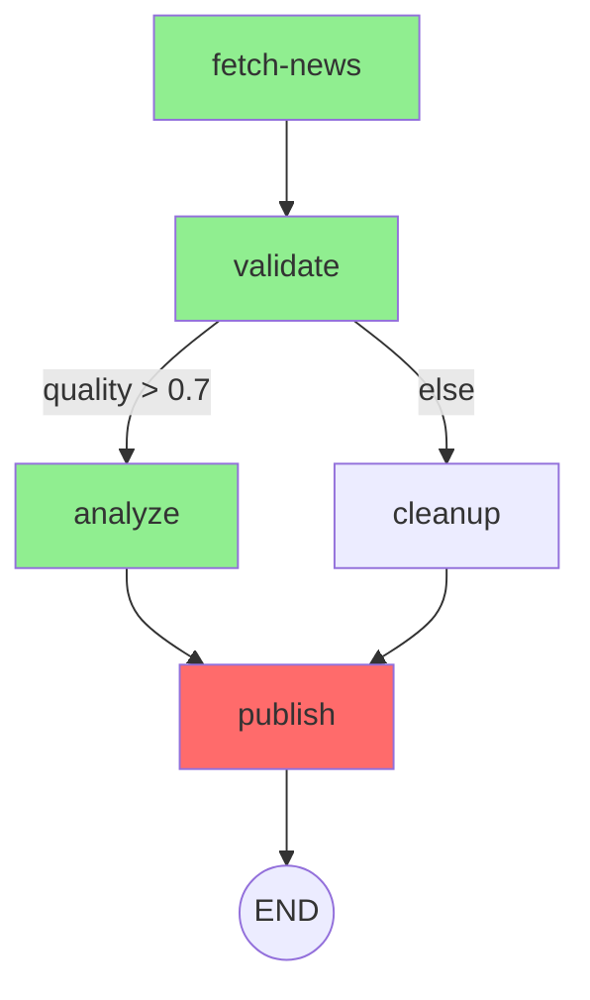

# Phase 4.5: Pipeline Hardening — Message Filtering, Dead Letter Queue, Visualization

## Goal

Close the remaining 3 gaps from the compass artifact analysis:
1. **MessageFilterAgent** — per-agent inbox filtering (AutoGen pattern)
2. **Dead Letter Queue** — failed pipeline steps queued for retry/inspection
3. **Pipeline Visualization** — ASCII in CLI + Mermaid in web dashboard

---

## 1. MessageFilterAgent (per-agent message filtering)

### Problem

All IPC messages land in agent's inbox unfiltered. Agent sees every message from every peer — creates noise, burns context tokens, and causes confusion when agent receives messages meant for a different workflow step.

AutoGen solves this with `MessageFilterAgent` — a wrapper that filters which messages an agent sees based on source, recency, and count.

### Design

Add filtering rules to IPC inbox retrieval. Each agent can configure which messages to see:

```toml
# Per-agent config: [agents_ipc.inbox_filter]
[agents_ipc.inbox_filter]
# Only show last 1 message from each source
default_per_source = 1
# Override for specific sources
[agents_ipc.inbox_filter.per_source]
"marketing-lead" = 3    # show last 3 from marketing-lead
"broker" = 5             # show last 5 from broker
# Filter by kind
allowed_kinds = ["task", "query", "result"]  # hide "text", "done"
```

### Implementation

**Domain types** (`crates/domain/src/config/schema.rs`):
```rust
pub struct InboxFilterConfig {
    pub default_per_source: usize,   // default 0 = no filter
    pub per_source: HashMap<String, usize>,
    pub allowed_kinds: Vec<String>,  // empty = all kinds
}
```

**IPC broker** (`crates/adapters/core/src/gateway/ipc/mod.rs`):
- `handle_ipc_inbox()` — apply filter before returning messages
- Filter logic: group by source agent, take last N per source, filter by kind
- No changes to message storage — filtering is read-side only

**Agent tools** (`crates/adapters/core/src/tools/agents_ipc.rs`):
- `agents_inbox()` tool — pass filter config from agent's config
- Optional `--unfiltered` flag for admin override

### Files to modify

| File | Change |
|------|--------|
| `crates/domain/src/config/schema.rs` | Add InboxFilterConfig |
| `crates/adapters/core/src/gateway/ipc/mod.rs` | Apply filter in inbox handler |
| `crates/adapters/core/src/tools/agents_ipc.rs` | Pass filter to inbox query |
| Agent config.toml files | Add `[agents_ipc.inbox_filter]` sections |

### Acceptance criteria

| # | Criterion |
|---|-----------|
| 1 | Agent with `default_per_source = 1` sees only latest message from each source |
| 2 | `per_source` overrides work for specific agents |
| 3 | `allowed_kinds` filters out unwanted message types |
| 4 | Unfiltered admin query still returns all messages |
| 5 | No changes to message storage (read-side only) |

---

## 2. Dead Letter Queue (DLQ) for failed pipeline steps

### Problem

When a pipeline step fails (timeout, agent error, validation failure), the step result is logged but lost. No retry mechanism, no inspection tool, no way to understand failure patterns across pipeline runs.

### Design

Add a `dead_letters` table to pipeline storage. Failed steps go to DLQ with full context for retry or inspection.

```sql
-- SurrealDB or SQLite (alongside pipeline runs)
CREATE TABLE dead_letters (
    id TEXT PRIMARY KEY,
    pipeline_run_id TEXT NOT NULL,
    step_id TEXT NOT NULL,
    agent_id TEXT NOT NULL,
    input TEXT,              -- JSON: what the step received
    error TEXT,              -- error message
    attempt INTEGER,         -- which attempt failed
    max_retries INTEGER,
    created_at DATETIME,
    status TEXT DEFAULT 'pending',  -- pending | retried | dismissed
    retried_at DATETIME,
    dismissed_by TEXT        -- operator who dismissed
);
```

### Implementation

**Domain types** (`crates/domain/src/domain/pipeline_context.rs`):
```rust
pub struct DeadLetter {
    pub id: String,
    pub pipeline_run_id: String,
    pub step_id: String,
    pub agent_id: String,
    pub input: serde_json::Value,
    pub error: String,
    pub attempt: u32,
    pub max_retries: u32,
    pub created_at: DateTime<Utc>,
    pub status: DeadLetterStatus,
}

pub enum DeadLetterStatus {
    Pending,
    Retried,
    Dismissed,
}
```

**Port** (`crates/domain/src/ports/`):
```rust
pub trait DeadLetterPort: Send + Sync {
    async fn enqueue(&self, letter: DeadLetter) -> Result<()>;
    async fn list_pending(&self, limit: usize) -> Result<Vec<DeadLetter>>;
    async fn retry(&self, id: &str) -> Result<()>;
    async fn dismiss(&self, id: &str, by: &str) -> Result<()>;
}
```

**Pipeline service** (`crates/domain/src/application/services/pipeline_service.rs`):
- In `execute_step_with_retries()`, after all retries exhausted → enqueue to DLQ
- Currently: logs error and sets state to Failed
- New: also calls `dead_letter_port.enqueue()`

**Gateway API**:
- `GET /api/pipelines/dead-letters` — list pending dead letters
- `POST /api/pipelines/dead-letters/:id/retry` — retry a dead letter
- `POST /api/pipelines/dead-letters/:id/dismiss` — dismiss

**CLI**:
- `synapseclaw pipeline dead-letters` — list
- `synapseclaw pipeline retry <id>` — retry
- `synapseclaw pipeline dismiss <id>` — dismiss

**Web dashboard** (existing IPC dashboard):
- New tab "Dead Letters" showing failed steps
- Retry/dismiss buttons per entry

### Files to modify

| File | Change |
|------|--------|
| `crates/domain/src/domain/pipeline_context.rs` | Add DeadLetter, DeadLetterStatus |
| `crates/domain/src/ports/` | Add dead_letter.rs port |
| `crates/domain/src/application/services/pipeline_service.rs` | Enqueue on failure |
| `crates/adapters/core/src/storage/` | SQLite/SurrealDB adapter for DLQ |
| `crates/adapters/core/src/gateway/mod.rs` | REST endpoints |
| `crates/adapters/core/src/commands.rs` | CLI commands |
| Web dashboard (static HTML) | Dead Letters tab |

### Acceptance criteria

| # | Criterion |
|---|-----------|
| 1 | Failed step after max retries → enqueued in DLQ with full context |
| 2 | `GET /api/pipelines/dead-letters` returns pending items |
| 3 | Retry re-executes the step with original input |
| 4 | Dismiss marks as resolved without retry |
| 5 | CLI `pipeline dead-letters` shows pending items |
| 6 | DLQ entries include: input, error, attempt count, timestamps |

---

## 3. Pipeline Visualization

### Problem

No way to see pipeline structure or execution state visually. Operators must read TOML definitions and parse logs to understand what's happening.

### Design

Two outputs:
- **ASCII** for CLI/logs/terminal
- **Mermaid** for web dashboard (renders as SVG via mermaid.js)

### ASCII format

```
synapseclaw pipeline show news-pipeline

news-pipeline (5 steps, entry: fetch-news)
═══════════════════════════════════════════
  [fetch-news] ──→ [validate]
                      │
                      ├── quality > 0.7 ──→ [analyze]
                      └── else ──→ [cleanup]
                                       │
  [analyze] ──→ [publish]              │
                    │                  │
                    └──────────────────┘
                           │
                         [END]

Last run: pipe-abc123 (2026-04-02 10:15)
  fetch-news:  ✅ 2.3s
  validate:    ✅ 0.8s
  analyze:     ✅ 15.2s
  publish:     ❌ FAILED (timeout after 30s) → DLQ
```

### Mermaid format



### Implementation

**Domain** (`crates/domain/src/domain/pipeline.rs`):
```rust
impl PipelineDefinition {
    pub fn to_ascii(&self) -> String { ... }
    pub fn to_mermaid(&self) -> String { ... }
}
```

These are pure functions on existing domain types — no new deps needed.

**CLI**:
- `synapseclaw pipeline show <name>` — ASCII rendering
- `synapseclaw pipeline show <name> --mermaid` — Mermaid output
- `synapseclaw pipeline show <name> --with-status` — include last run status

**Gateway API**:
- `GET /api/pipelines/:name/graph?format=mermaid` — returns Mermaid string
- `GET /api/pipelines/:name/graph?format=ascii` — returns ASCII string

**Web dashboard**:
- Pipeline detail page shows Mermaid graph rendered via `<script src="mermaid.min.js">`
- Step colors: green = success, red = failed, gray = pending, yellow = running
- Click on step → shows last execution details

### Files to modify

| File | Change |
|------|--------|
| `crates/domain/src/domain/pipeline.rs` | Add to_ascii(), to_mermaid() |
| `crates/adapters/core/src/commands.rs` | Add PipelineCommands::Show |
| `crates/adapters/core/src/gateway/mod.rs` | Add /api/pipelines/:name/graph endpoint |
| Web dashboard static HTML | Add pipeline graph page with mermaid.js |

### Acceptance criteria

| # | Criterion |
|---|-----------|
| 1 | `pipeline show <name>` renders ASCII graph in terminal |
| 2 | `--mermaid` flag outputs valid Mermaid syntax |
| 3 | Web dashboard renders pipeline as interactive SVG |
| 4 | Step status colors reflect last run outcome |
| 5 | FanOut/FanIn rendered correctly (parallel branches) |
| 6 | Conditional branches show condition labels |

---

## Slices

| Slice | Description | Effort |
|-------|-------------|--------|
| 1 | MessageFilterAgent — config, IPC filter logic, tool integration | 1 day |
| 2 | Dead Letter Queue — domain types, port, pipeline integration, API | 2 days |
| 3 | Pipeline Visualization — ASCII + Mermaid + CLI + API | 1 day |
| 4 | Web dashboard — DLQ tab + pipeline graph page | 1 day |

---

## Dependencies

- Slice 1: independent (IPC layer only)
- Slice 2: depends on pipeline_service.rs (Phase 4.1 code)
- Slice 3: depends on pipeline.rs domain types (Phase 4.1)
- Slice 4: depends on Slices 2+3

## Deferred

- Per-step tool scoping enforcement (compile-time, not runtime) — needs Rust enum StepOutput
- Pipeline marketplace/sharing — needs stable format first
- Multi-host pipeline execution — needs federated execution (Phase 4.2)
