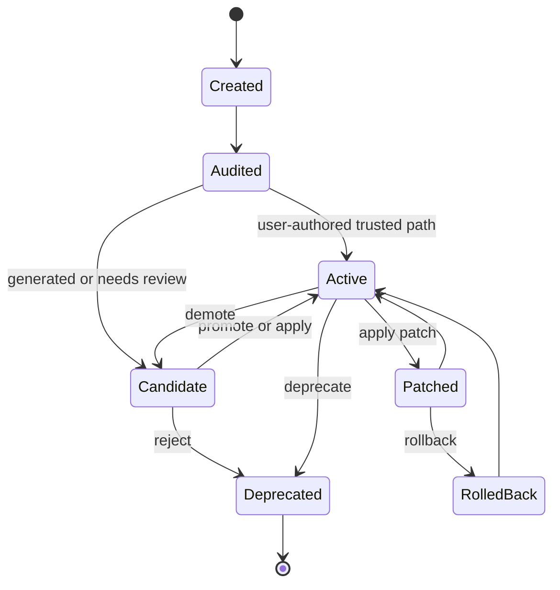

# Skill Lifecycle Reference

The skill lifecycle is the source of truth for user, web, CLI, and runtime behavior.

## Core Flow

1. Create or import a skill.
2. Audit the body and metadata.
3. Store the skill as active, candidate, or deprecated.
4. Expose compact catalog entries for retrieval.
5. Load full instructions through `skill_read` when relevant.
6. Record activation and use traces.
7. Use health signals for cleanup, ranking, and review.

## Generated Patch Flow

1. A patch candidate targets an existing skill version.
2. The operator runs diff and test.
3. Apply requires matching target version and passing replay/eval gates.
4. The previous body is saved as a rollback snapshot.
5. Versions and rollback records preserve audit history.

## Package Flow

Local workspace `SKILL.*` packages are ported into memory and moved to `workspace/skills/ported/`. Imported or open-skills packages remain file-backed but receive compact index cards for semantic discovery.

## Transition Rules

- `active` skills are loadable through the governed runtime path.
- `candidate` skills need review, promotion, or patch apply before normal use.
- `deprecated` skills stay available for history, audit, and rollback, but should not be selected for normal tasks.
- Patch apply must preserve a version trail and rollback snapshot.
- Imported packages should not be mutated as if they were memory-owned skills.
