# Skills Mental Model

A skill is how Synapseclaw turns repeated work into governed, reusable capability without bloating the model context. It is not a prompt snippet and not a memory note; it is a procedure that can be discovered, activated, measured, improved, and rolled back.

Think of a skill as this bundle:

```text
reusable procedure + metadata + audit + retrieval + activation + traces + health + versioning + rollback
```

## The Core Loop

```mermaid
flowchart LR
    Task[User task] --> Catalog[Compact skill catalog]
    Catalog --> Select[Relevant skill selected]
    Select --> Read[skill_read loads full body]
    Read --> Execute[Agent follows skill and uses tools]
    Execute --> Trace[Compact activation and use trace]
    Trace --> Health[Health and utility signals]
    Health --> Improve[Patch, cleanup, or review candidate]
    Improve --> Review[Review, test, apply, or reject]
```



The model should not receive every skill body at startup. It receives compact cards, chooses the relevant skill, then asks the runtime to load that skill through `skill_read`.

## What A Skill Should Capture

A skill should capture a repeatable way to do work. It should not capture the result of one task, a private token, a one-off conversation, or vague advice.

Good skills usually contain:

- when to use the procedure;
- what inputs matter;
- what steps to follow;
- what tools are expected;
- what to report back;
- what not to do.

## Why Skills Are Governed

Skills can change agent behavior, so they need lifecycle and evidence. A generated patch should not silently rewrite an active skill, and a package should not enter the runtime catalog if it contains unsafe instructions.

Governance gives the system a controlled path: audit, candidate review, eval, apply, version trail, health signals, and rollback.

