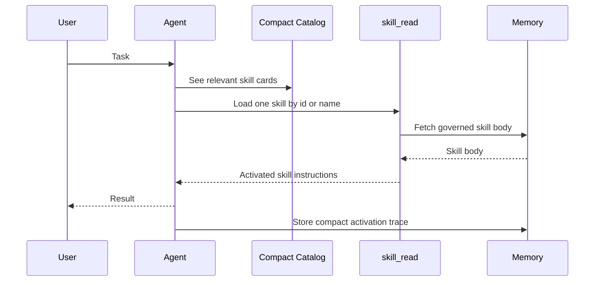

# On-Demand Skill Loading

Synapseclaw should not send every full skill body to the model on every turn. That would make skills look simple, but it would waste context and make old or irrelevant procedures compete with the current task.

The runtime uses progressive disclosure:

1. The model sees compact skill cards.
2. A relevant card points to `skill_read`.
3. `skill_read` loads one governed full body.
4. The current tool cycle can use the full instructions.
5. Later history keeps compact activation receipts, not repeated full bodies.

## What Goes Into Context

Compact cards can include id, name, description, status, origin, task family, tags, and tool hints. They should be enough for the model to decide whether a skill may matter.

Full skill bodies enter provider context only when activated. Completed activations collapse into compact receipts that preserve identity and provenance without repeatedly injecting the instructions.

## What This Prevents

On-demand loading prevents skill libraries from becoming hidden prompt bloat. It also makes skill use measurable: if a body was loaded, the runtime can record that activation and connect it to later health signals.

